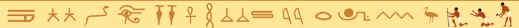

# Matematik grundforløbet

----

  
Matematikkens historie

  
  | | |
  | -- | -- |
  | <b>Oldtid (3000–500f.Kr.)</b>   | Redskab til praktiske formål, Jordnær, teknisk |
  | <b>Antik græsk (600f.Kr.–300e.Kr.)</b> | Bevisbaseret videnskab, Forbundet med åndelig orden  |
  | <b>Moderne tid (1500–nu)</b> | Autonom videnskab og naturbeskrivelse, Sekulær, men forunderligt effektiv |

  

  
Den moderne definition af matematik

  
Autonom Aksiomatisk Deduktiv Videnskab

