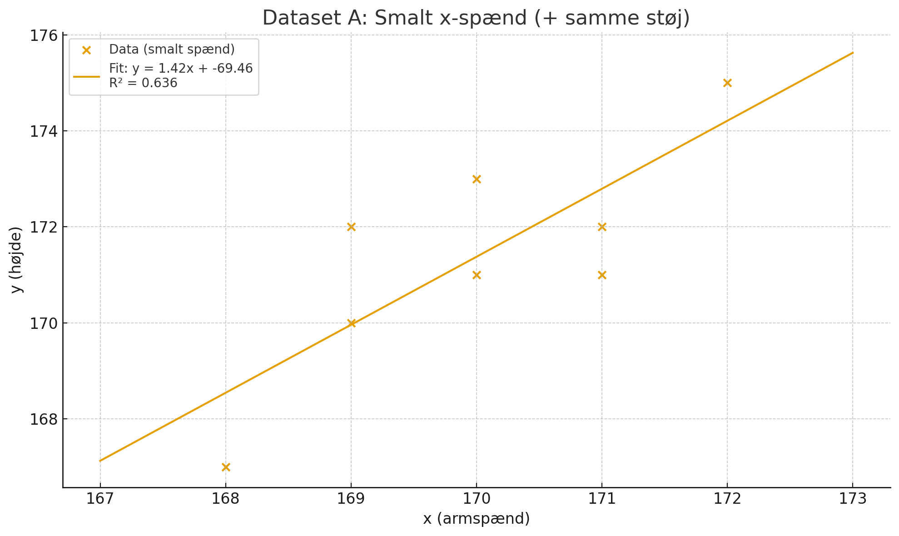
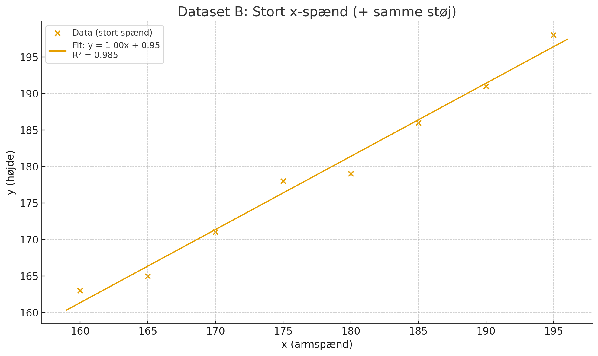

# En eksemplificering ... med grafer 

-----

# Hvorfor er forklaringsgraden god/dårlig ?

## Smalt spænd i målinger (data)

| x (armspænd) | støj e | y = x + e | ŷ (fit) | residual (y − ŷ) |
| :----------: | :----: | :-------: | :-----: | :--------------: |
|      170     |   -1   |    169    |  170.46 |       -1.46      |
|      171     |   -2   |    169    |  171.88 |       -2.88      |
|      169     |    3   |    172    |  169.05 |       2.95       |
|      172     |   -3   |    169    |  172.88 |       -3.88      |
|      168     |    2   |    170    |  167.63 |       2.37       |
|      170     |   -1   |    169    |  170.46 |       -1.46      |
|      171     |   -3   |    168    |  171.88 |       -3.88      |
|      169     |    2   |    171    |  169.05 |       1.95       |

## Stort spænd i målinger (data)

| x (armspænd) | støj e | y = x + e | ŷ (fit) | residual (y − ŷ) |
| :----------: | :----: | :-------: | :-----: | :--------------: |
|      160     |   -1   |    159    |  160.80 |       -1.80      |
|      165     |   -2   |    163    |  165.82 |       -2.82      |
|      170     |    3   |    173    |  170.83 |       2.17       |
|      175     |   -3   |    172    |  175.85 |       -3.85      |
|      180     |    2   |    182    |  180.86 |       1.14       |
|      185     |   -1   |    184    |  185.87 |       -1.87      |
|      190     |   -3   |    187    |  190.88 |       -3.88      |
|      195     |    2   |    197    |  195.89 |       1.11       |

## Forklaringsgrader

| Scenario      | Hældning a | Skæring b |   R²  | SS₍res₎ (uforklaret) | SS₍tot₎ (total) |
| :------------ | :--------: | :-------: | :---: | :------------------: | :-------------: |
| Smalt x-spænd |    1.417   |  −69.458  | 0.636 |         13.79        |      37.88      |
| Stort x-spænd |    1.002   |   0.952   | 0.985 |         15.87        |     1070.88     |

## Konklusion:

<!-- MathJax loader -->

(1) I smalt x-spænd er variationen i x lille, så støjen udgør en stor del af den totale variation → R² ≈ 0,64.

(2) I stort x-spænd er signalet langt stærkere end støjen → R² ≈ 0,99.

Dette ses i formlen (der kun gælder under vise specielle omstændigheder se [matematisk ræsonement](/del13_projekt_forklaringsgrad/del13A.md)) :

<html>
\( \LARGE R² =   \frac{ a^2 \cdot \sum (x - \bar{x})^2 }{ a^2 \cdot \sum  (x - \bar{x})^2 + \sum e^2 }    \)
</html>

