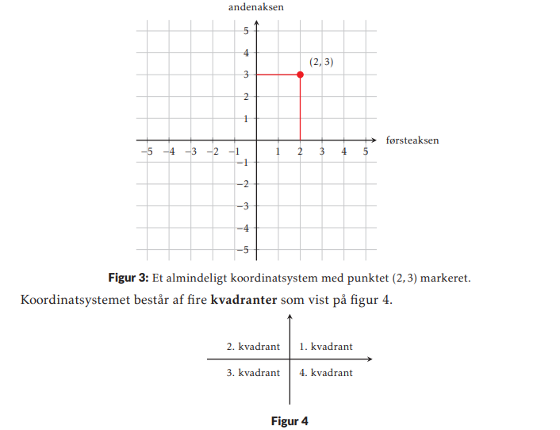

# Matematik grundforløbet

---

## Koordinatsystemet : vigtigste "termer" fra kapitlet

  

  
 Akser 

  <ul>
  <li>hvad er første og anden akse ? </li>
  <li>hvad er origo ? </li>
  </ul>

  
 Kvadranter 

  <ul>
  <li>Hvad er kvadranter ? </li>
  <li>Har du en smart måde at huske på hvor de forskellige kvadranter er? </li>
  </ul>

  
 Koordinater 

  <ul>
  <li>hvad er første og anden koordinat ? </li>
  <li>hvordan finder man punkter vha. af koordinaterne </li>
  <li>hvorfor mon man kalder det et "retvinklet" koordinatsystem ? </li>
  </ul>

  
 Enheder 

  <ul>
  <li>hvad er enheder ? </li>
  <li>hvordan skrives enhederne på i koordinatsystemet ? </li>
  </ul>

